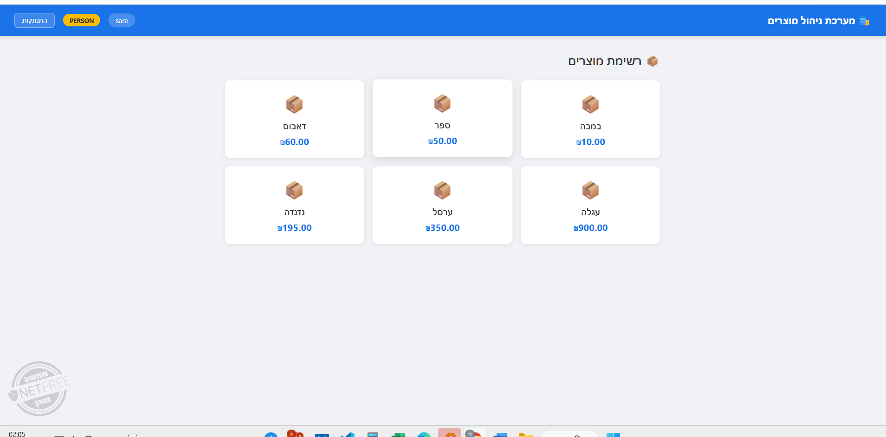
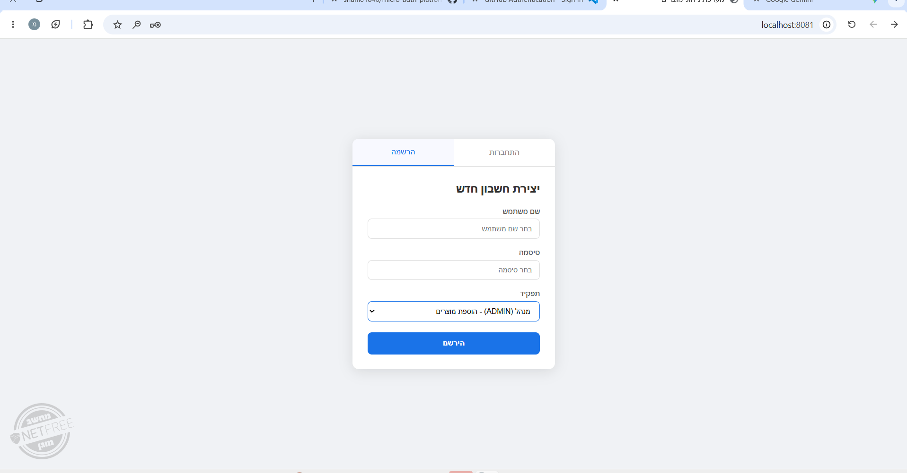
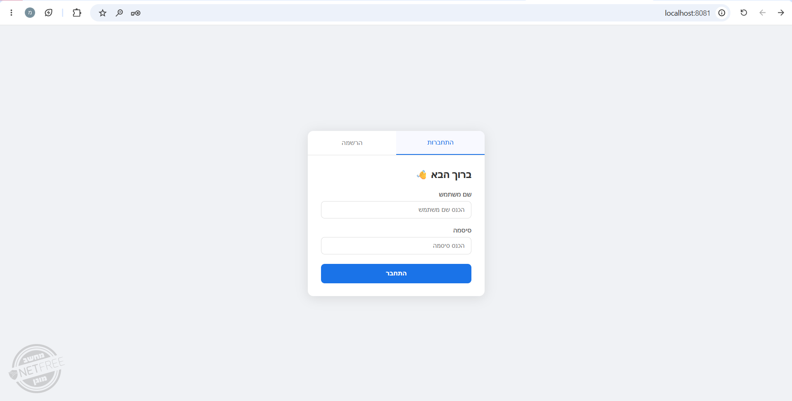
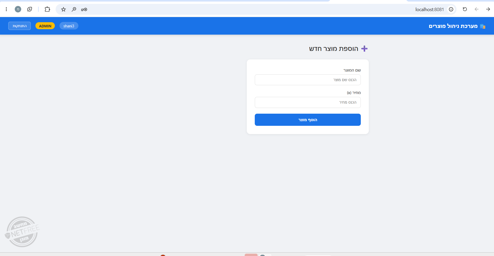

# 🛍️ מערכת ניהול מוצרים ומשתמשים - Spring Boot


## 📋 תיאור הפרויקט

מערכת ניהול מוצרים ומשתמשים מתקדמת הבנויה על ארכיטקטורה של microservices עם Spring Boot. המערכת כוללת ממשק אדמין לניהול מוצרים, רישום והתחברות משתמשים, וניהול מסד נתונים מתקדם.

## 🏗️ ארכיטקטורת המערכת

```
├── 🔐 Security Service (Port 8081)
│   ├── JWT Authentication
│   ├── Spring Security
│   └── WebFlux Gateway
│
├── 📊 JPA Service (Port 8082)
│   ├── Product Management
│   ├── User Management
│   ├── PostgreSQL Integration
│   └── Aspect-Oriented Programming
│
└── 🗄️ PostgreSQL Database (Port 5432)
    ├── Products Table
    └── Users Table
```

## 🛠️ טכנולוגיות ומסגרות

### Backend Technologies
- **Java 21** - שפת התכנות הראשית
- **Spring Boot 3.2.5** - מסגרת הפיתוח הראשית
- **Spring Data JPA** - ניהול מסד נתונים
- **Spring Security** - אבטחה והרשאות
- **Spring WebFlux** - תכנות ריאקטיבי
- **Spring AOP** - תכנות מוכוון היבטים

### Database & Infrastructure
- **PostgreSQL 15** - מסד נתונים יחסי
- **Docker & Docker Compose** - קונטיינריזציה
- **Maven** - ניהול dependencies

### Security & Authentication
- **JWT (JSON Web Tokens)** - אימות והרשאה
- **JJWT Library 0.11.5** - יצירת ואימות JWT

### Development Tools
- **Lombok** - הפחתת boilerplate code
- **Aspect-Oriented Programming** - logging וניטור

## 📸 צילומי מסך

### 🏠 דף הבית - ממשק המשתמש

*ממשק ראשי עם אפשרויות הוספת מוצרים ורישום משתמשים*

### 👤 רישום משתמש חדש

*טופס רישום משתמש חדש למערכת*

### 🔑 התחברות למערכת

*מסך התחברות עם אימות משתמש*

### 🛡️ פאנל אדמין - ניהול מוצרים

*ממשק אדמין מתקדם לניהול מוצרים עם אפשרויות מחיקה*

## 🚀 התקנה והפעלה

### דרישות מערכת
- Docker Desktop
- Java 21 (אופציונלי לפיתוח)
- Git

### הפעלת המערכת
```bash
# שכפול הפרויקט
git clone <repository-url>
cd FinalProject

# הפעלת המערכת עם Docker
docker-compose up --build

# או בפון רקע
docker-compose up -d --build
```

### בדיקת המערכת
```bash
# בדיקת קונטיינרים פעילים
docker ps

# צפייה בלוגים
docker-compose logs -f
```

## 🌐 API Endpoints

### Products API (JPA Service - Port 8082)

| Method | Endpoint | Description |
|--------|----------|-------------|
| `GET` | `/products` | קבלת כל המוצרים |
| `POST` | `/products/add` | הוספת מוצר חדש |
| `DELETE` | `/products/{id}` | מחיקת מוצר לפי ID |
| `DELETE` | `/products/all` | מחיקת כל המוצרים |

### Users API (JPA Service - Port 8082)

| Method | Endpoint | Description |
|--------|----------|-------------|
| `GET` | `/users` | קבלת כל המשתמשים |
| `GET` | `/users/{id}` | קבלת משתמש לפי ID |
| `POST` | `/users/add` | הוספת משתמש חדש |

### דוגמאות שימוש

#### הוספת מוצר חדש
```bash
curl -X POST http://localhost:8082/products/add \
  -H "Content-Type: application/json" \
  -d '{"name": "laptop", "price": 3500.00}'
```

#### מחיקת מוצר ספציפי
```bash
curl -X DELETE http://localhost:8082/products/1
```

#### רישום משתמש חדש
```bash
curl -X POST http://localhost:8082/users/add \
  -H "Content-Type: application/json" \
  -d '{"name": "John Doe", "address": "123 Main St", "phoneNumber": "0501234567"}'
```

## 📁 מבנה הפרויקט

```
FinalProject/
├── 📂 demo/ (JPA Service)
│   ├── 📂 src/main/java/com/example/demo/
│   │   ├── 📂 Aspects/
│   │   │   └── LoggingAspect.java
│   │   ├── 📂 Controllers/
│   │   │   ├── ProductController.java
│   │   │   └── UserController.java
│   │   ├── 📂 Entities/
│   │   │   ├── Product.java
│   │   │   ├── User.java
│   │   │   └── Carditional.java
│   │   ├── 📂 Repositories/
│   │   │   ├── ProductRepository.java
│   │   │   └── UserRepository.java
│   │   └── 📂 Services/
│   │       └── ProductService.java
│   ├── 📂 src/main/resources/
│   │   ├── 📂 static/
│   │   │   └── index.html
│   │   └── application.properties
│   └── Dockerfile
│
├── 📂 Security/ (Security Service)
│   ├── 📂 src/main/java/com/example/demo/
│   │   └── DemoApplication.java
│   ├── 📂 src/main/resources/
│   │   └── application.properties
│   └── Dockerfile
│
├── 📂 images/
│   ├── admin.png
│   ├── login.png
│   ├── register.png
│   └── user.png
│
├── docker-compose.yaml
└── README.md
```

## ⚙️ הגדרות מתקדמות

### משתנים של Environment
```yaml
# PostgreSQL
POSTGRES_USER: postgres
POSTGRES_PASSWORD: secret
POSTGRES_DB: app_db

# Spring Boot
SPRING_DATASOURCE_URL: jdbc:postgresql://postgres-db:5432/app_db
SPRING_JPA_HIBERNATE_DDL_AUTO: update
```

### פורטים
- **Frontend & JPA Service**: `http://localhost:8082`
- **Security Service**: `http://localhost:8081`
- **PostgreSQL Database**: `localhost:5432`

## 🎯 פיצ'רים עיקריים

### ✅ ניהול מוצרים
- הצגת כל המוצרים
- הוספת מוצר חדש
- מחיקת מוצר ספציפי
- מחיקת כל המוצרים
- ממשק אדמין אינטואיטיבי

### ✅ ניהול משתמשים
- רישום משתמשים חדשים
- התחברות למערכת
- אחסון בטוח במסד נתונים

### ✅ אבטחה
- שירות אבטחה נפרד
- JWT Token support
- Spring Security integration

### ✅ ממשק משתמש
- עיצוב רספונסיבי
- תמיכה בעברית (RTL)
- ממשק אדמין מתקדם
- הודעות משתמש ברורות

## 🔧 פיתוח ותחזוקה

### הפעלה במצב פיתוח
```bash
# הפעלת מסד הנתונים בלבד
docker-compose up postgres-db

# הפעלת השירותים ב-IDE
# JPA Service: port 8082
# Security Service: port 8081
```

### בדיקת בריאות המערכת
```bash
# בדיקת JPA Service
curl http://localhost:8082/products

# בדיקת קישוריות למסד הנתונים
docker-compose exec postgres-db psql -U postgres -d app_db -c "SELECT 1;"
```

## 📊 ניטור וביצועים

### Logging
המערכת כוללת Aspect-Oriented Programming לניטור:
- לוגים אוטומטיים לכל קריאות API
- מעקב אחר ביצועים
- דיווח על שגיאות

### Metrics
- מעקב אחר זמני תגובה
- ניטור שימוש במשאבים
- לוגים של מסד הנתונים

## 🤝 תרומה לפרויקט

1. Fork את הפרויקט
2. צור branch חדש (`git checkout -b feature/amazing-feature`)
3. Commit השינויים (`git commit -m 'Add amazing feature'`)
4. Push ל-branch (`git push origin feature/amazing-feature`)
5. פתח Pull Request

## 📝 רישיון

הפרויקט מופץ תחת רישיון MIT. ראה קובץ `LICENSE` לפרטים נוספים.

## 👨‍💻 מפתחים

- **שם המפתח** - פיתוח מלא של המערכת

## 📞 יצירת קשר

- 📧 Email: your.email@example.com
- 🔗 LinkedIn: [הפרופיל שלך](https://linkedin.com/in/yourprofile)
- 📱 GitHub: [@yourusername](https://github.com/yourusername)

---

<p align="center">
  <strong>🚀 פרויקט גמר בקורס Java Advanced - Spring Boot Microservices</strong>
</p>

<p align="center">
  Made with ❤️ using Spring Boot & Docker
</p>